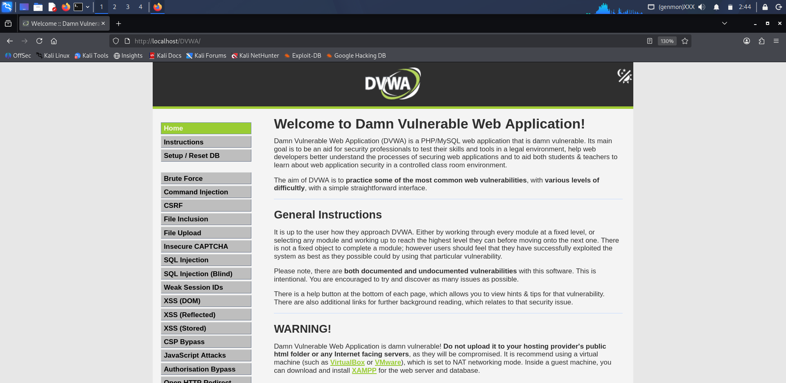
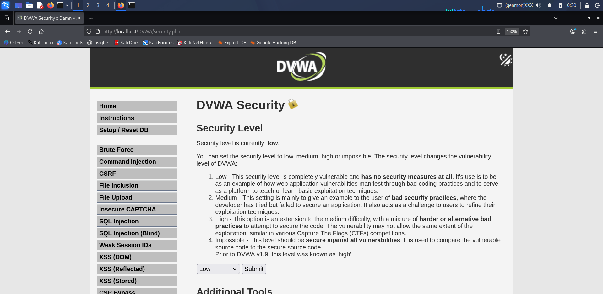
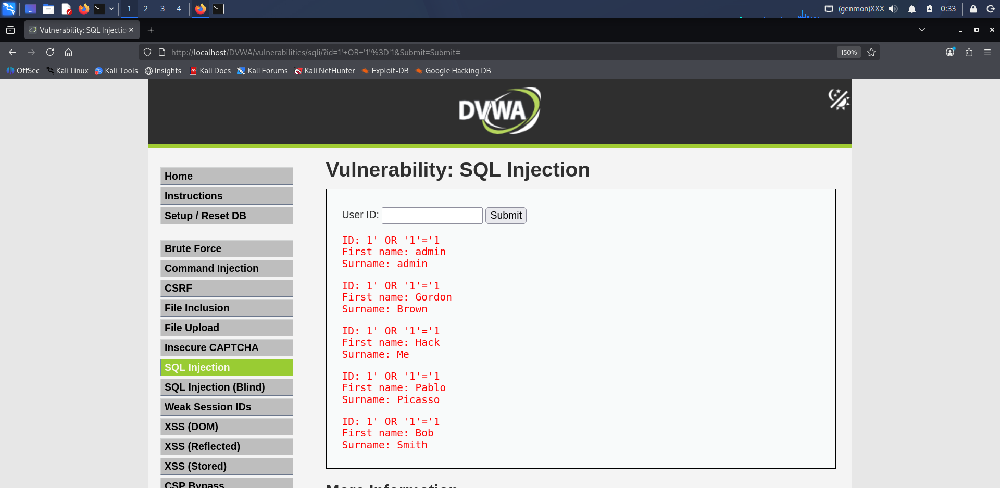
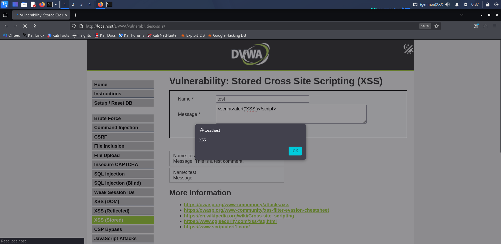
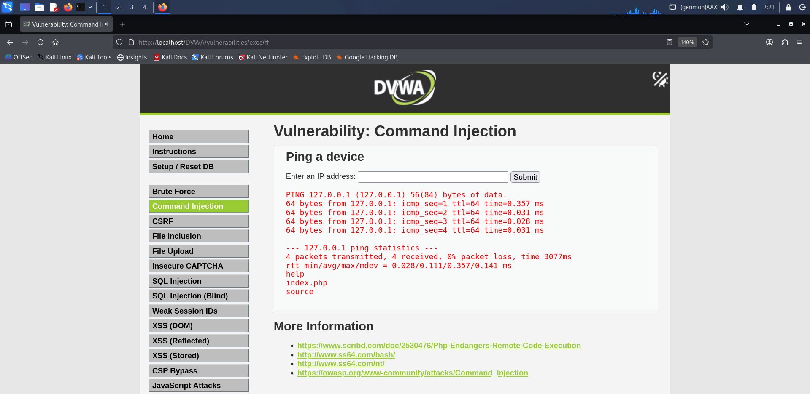

# DVWA Security Testing Project

## 📌 Overview
This project demonstrates basic web application vulnerabilities using DVWA (Damn Vulnerable Web Application) in a controlled local environment.

The goal is to understand how common attacks work and how security levels affect them.

---

## 🎯 Objectives
- Perform SQL Injection attack
- Perform Cross-Site Scripting (XSS)
- Perform Command Injection
- Analyze behavior under different security levels

---

## 🛠️ Tools & Technologies
- Kali Linux
- DVWA (Damn Vulnerable Web Application)
- Apache Server
- MySQL
- Web Browser (Firefox)

---

## 🔓 Security Level
Security level was set to **LOW** for performing attacks.

Additional testing was done on **HIGH** level to observe mitigation.

---

## 🚀 Vulnerabilities Demonstrated

### 1. SQL Injection
- Input: `1' OR '1'='1`
- Result: Retrieved multiple user records from database

### 2. Cross-Site Scripting (XSS - Stored)
- Payload: ``
- Result: JavaScript executed in browser (alert popup)

### 3. Command Injection
- Input: `127.0.0.1 && ls`
- Result: System command executed and directory files listed

---

## 📊 Observations
- Low security level allows easy exploitation
- High security level blocks most attacks
- Command Injection partially works even at higher levels

---

## 📸 Screenshots

### DVWA Setup

### Security Level (Low)

### SQL Injection

### XSS Attack

### Command Injection

---

## ✅ Conclusion
This project helped in understanding real-world web vulnerabilities and how improper input validation leads to security risks.

It also demonstrated the importance of secure coding practices and input sanitization.

---

## ⚠️ Disclaimer
This project was performed in a local environment for educational purposes only.
